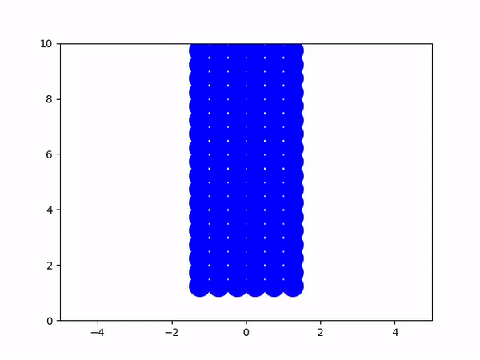
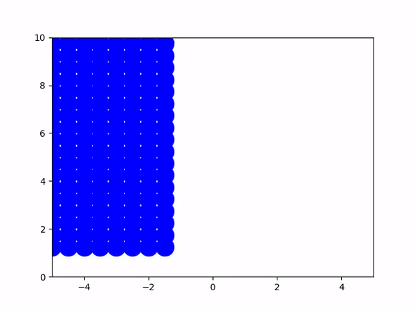

# CSC417 Final Project

This is the README for CSC417: Physics-Based Animation, final project. 
The video associated with this submission is located here:
https://youtu.be/RHVkoMmS28c


## Description

This project covers Fluid Simulation using 2D SPH.
* Low Viscosity, Single Stream

* High Viscosity, Single Stream

* Low Viscosity, Multi Stream

* High Viscosity, Multi Stream

* Low Viscosity, Dam

* High Viscosity, Dam



## Getting Started

### Dependencies

* Describe any prerequisites, libraries, OS version, etc., needed before installing program.
* Prerequisites: Tested on macOS mojave
* Python: 3.6.10
* numpy >= 1.19.2  
* matplotlib >= 3.3.2

### Executing program

In 2d_spy.py, there are 2 flags you can tune:
* mu -> float between [0.2 - 5] -> this sets the viscosity (lower = lower viscosity)
* scene -> choices are either 'ss', 'ms', or 'dam', describing a single stream, multistream, or dam break scenario

* To run this program, examples include: 
```
python 2d_sph.py --scene ss --mu 0.25
python 2d_sph.py --scene ms --mu 1.5
python 2d_sph.py --scene dam --mu 0.25

```


- The output of this file is a ~8 second video with the following naming format:
```
{mu}_{scene}.mp4
```
Example input and output:
```
python 2d_sph.py --scene ms --mu 0.5 
0.5_ms.mp4
```

NOTE: Simulation for 500 particles will take about ~ 3 minutes to run and output a video, depending on your workstation. (I.e., don't click on the video output until the python file has output "Video Saved")

## Authors

Contributors names and contact info

Lalit Lal
lalit.lal@mail.utoronto.ca
